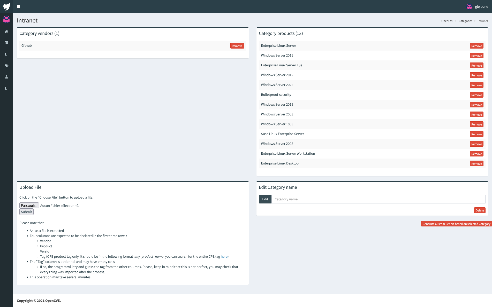
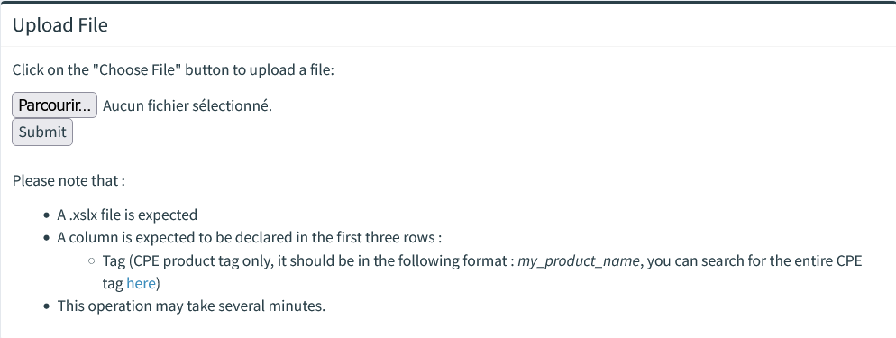
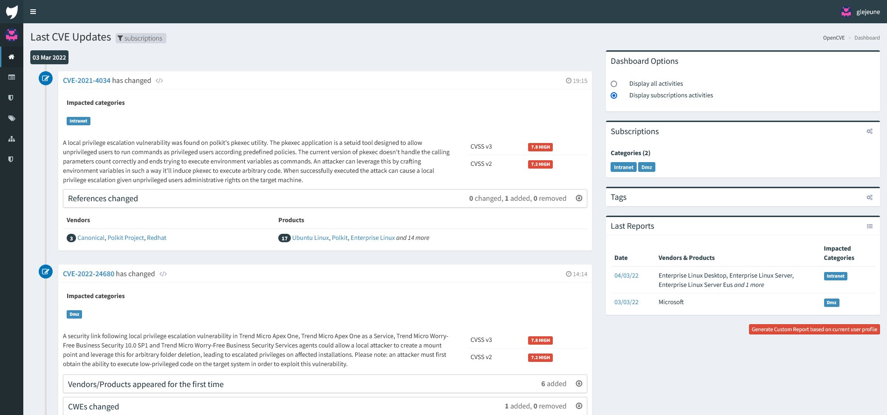

# What is this fork ?
## Features that are specific to this fork
Please not that this section is about features that are currently in progress or likely to evolve. This section may not be up to date.
### The complete CPE tag handling branch
On [this branch](https://github.com/Gael-Lejeune/opencve/tree/cpe-version), the CPE tag handling is complete.
You can follow CPE tags instead of products. It means that you can use the following syntax:
```
cpe:2.3:a:microsoft:windows_10:1.2:*:*:*:*:*:*
```
This way, you will be alerted if a CVE is published for a product that falls under this CPE tag like:
```
cpe:2.3:a:microsoft:windows_10:*:*:*:*:*:*:*
```
or
```
cpe:2.3:a:microsoft:windows_10:1.2:18:*:*:*:*:*
```
If you want to know how to use this specific branch, please refer to the [installation instructions](installation/docker.md).

!!!info
    You can search for the entire CPE tag of your product [here](https://nvd.nist.gov/products/cpe/search).<br>
    You can learn more on CPE tag [here](https://nvd.nist.gov/products/cpe).

!!!warning
    Please note that the CPE tag handling is not complete. This branch is still in development and may change in the future.
    Because of this, I advise you to use the [master branch](https://github.com/Gael-Lejeune/opencve) of the fork.

    It is also important to note that the app will run slower than on the master branch and a lot of heavy requests will be made to the database. You may experience some lag.

    Installation will also be a bit slower.
    
### The "category" system.
You can view this as a "category" feature. The goal is to add a category, and to register several Vendors or products in it. This way, you can follow your category, and be alerted whenever something impacting it happens.

You can also add vendors or products to a followed category on the vendor and product list by hand.

### Category model

```python
from opencve.context import _humanize_filter
from opencve.extensions import db
from opencve.models import BaseModel, categories_vendors,categories_products,users_categories


class Category(BaseModel):
    __tablename__ = "categories"

    name = db.Column(db.String(), nullable=False, unique=True)

    # Relationships
    vendors = db.relationship("Vendor", secondary=categories_vendors)
    products = db.relationship("Product", secondary=categories_products)
    users = db.relationship("User", secondary=users_categories)


    @property
    def human_name(self):
        return _humanize_filter(self.name)

    def __repr__(self):
        return "<Category {}>".format(self.name)
```
In addition, we needed to create categories_vendors, categories_products and users_categories in order to assure the relationship between the category table and vendors, products and users table respectively. We discussed those relationships before and how to create them in the __init__.py file.   

In admin.py, I needed to add the CategoryModelView as below :

```python
from opencve.models.categories import Category
class CategoryModelView(AuthModelView):
    page_size = 20
    create_modal = False
    edit_modal = False
    can_view_details = True
    column_list = ["name", "created_at"]
```

Category tables are now added automatically when building the project.

### Command to create a category
The create_category.py script is used to create a category, it can be used as follows:   
```sh
docker exec -it webserver opencve create-category <category-name>
```
### A view to see all the existing categories

The page templates/categories.html alongside views/category.py and controllers/subscriptions.py are used to view the category table and manage subscribtion for users.


It is used exactly like the vendors page but to manage categories.

### A view to see the details of a category and modify it
The user is now able to see and update the category subscribtions manually (we will see that next) or using an excel file.   
We can do that by navigating to "/category/<category name\>". 



### An new import function
Using an excel file (.xlsx), the user can update the category products. The excel file format is described on the web page.


!!!note
    CPE product tag only should be in the following format : my_product_name<br>
    CPE complete tag should be in the following format : cpe:<cpe_version\>:<part\>:<vendor\>:<product\>:<version\>:...<br>

!!!info
    You can search for the entire CPE tag [here](https://nvd.nist.gov/products/cpe/search).<br>
    You can learn more on CPE tag [here](https://nvd.nist.gov/products/cpe).

For the moment, the function is not perfectly optimized and can only use .xlsx files.
!!!warning
    This operation may take several minutes depending on the size of you file.


The read_excel is the function that will read the excel input and populate the database, it can be found at controllers/categories.py
The searching function can be found in the same file.

### Updated Dashboard
Updated dashboard to be able to see the CVEs related to a followed category.   
This was done by updating the template/home.html page alongside "controllers/home.py".   
The main code was to check the current user categories and add their respective vendors and products to the vendors list.




### Added category Action in vendor and products

If the current user is following a category, he will be able to add new vendors and products to the category subscribtions directly from the vendors or products pages:


### Managing reports and emails
In order to create alerts for users subscribed to a category we edited the tasks/alerts.py script
```python
 # Product contains the separator
            if PRODUCT_SEPARATOR in v:
                vendor = Vendor.query.filter_by(
                    name=v.split(PRODUCT_SEPARATOR)[0]
                ).first()
                product = Product.query.filter_by(
                    name=v.split(PRODUCT_SEPARATOR)[1], vendor_id=vendor.id
                ).first()
                categories = Category.query.filter(
                    Category.products.contains(product)
                    ).all()
                for user in product.users:
                    if user not in users.keys():
                        users[user] = {"products": [], "vendors": []}
                    users[user]["products"].append(product.name)
                for category in categories:
                    for user in category.users:
                        if user not in users.keys():
                            users[user] = {"products": [], "vendors": []}
                        users[user]["products"].append(product.name)

            # Vendor
            else:
                vendor = Vendor.query.filter_by(name=v).first()
                categories = Category.query.filter(
                    Category.vendors.contains(vendor)
                    ).all()
                for user in vendor.users:
                    if user not in users.keys():
                        users[user] = {"products": [], "vendors": []}
                    users[user]["vendors"].append(vendor.name)
                for category in categories:
                    for user in category.users:
                        if user not in users.keys():
                            users[user] = {"products": [], "vendors": []}
                        users[user]["vendors"].append(vendor.name)
```
We loop through the user categories and select the vendors and products from them.

This will create a list of users that will receive emails.

## Encountered problems
- When you want to upgrade the DB, you will sadly have to make clean and thus re-import the data. The "import-light" function may be optimized to make it even faster and thus help with this problem.
- Please use info() or logger.info() to debug or display logs as print() may not display correctly.